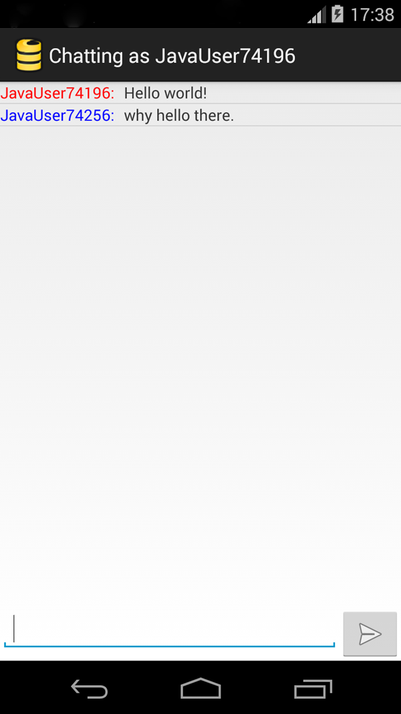

# Firebase Chat for Android

A simple chat application that built with Firebase on Android.

## Setup

Update [`MainActivity`](/app/src/main/java/com/firebase/androidchat/MainActivity.java) and replace
`https://android-chat.firebaseio-demo.com` with a reference to your Firebase.

## What's here

This application's
[`FirebaseListAdapter`](/app/src/main/java/com/firebase/androidchat/FirebaseListAdapter.java)
demonstrates binding Firebase to an Android
[ListView](https://developer.android.com/guide/topics/ui/layout/listview.html).
Firebase keeps the list data up to date based on a mapping to a model class.

## More about Firebase on Android

You can do lots more with Firebase on Android. Check out our Android
[Quickstart guide](https://www.firebase.com/docs/java-quickstart.html) to learn more.
